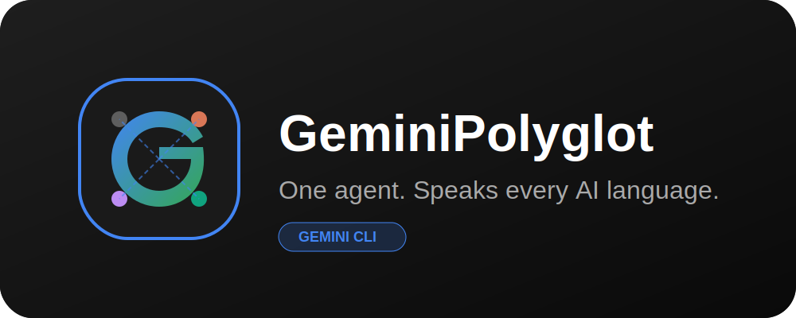

# 🌐 GeminiPolyglot for Gemini CLI



**Gemini now speaks Claude, Cursor, and Codex fluently.** 🗣️ Stop translating your project rules by hand—GeminiPolyglot is the ultimate linguistic bridge that makes Gemini CLI a true polyglot in the AI engineering world.

---

## 🚀 Why Use This?

The AI ecosystem is fragmented. Every agent has its own "dialect"—proprietary rulesets, custom tool definitions, and unique slash commands. Instead of choosing one agent or manually rewriting your instructions, **GeminiPolyglot** bridges the gap, making Gemini CLI the most compatible agent in your toolkit.

### ✨ Key Features

- **🖱️ Cursor Master:** Effortlessly parse `.cursorrules` and modular `.mdc` instructions. Gemini now respects your Cursor-specific "always/never" imperatives and path-based glob patterns.
- **🧱 Claude Code Bridge:** Full fluency in Claude's tool-calling dialects. Map `AskUserQuestion`, MCP server configs, and TypeScript `tool()` definitions directly to Gemini's native capabilities.
- **🛰️ Copilot Navigator:** Gemini now navigates modular `.github/skills/` and project-wide `.github/copilot-instructions.md` like a native. It even understands the multi-agent `AGENTS.md` standard.
- **📜 ChatGPT Codex Ingester:** Bring your custom system prompts, `*.codexrules`, and complex JSON function schemas from the Codex world into Gemini without missing a beat.
- **⚡ Proactive Linguistic Guard:** Gemini doesn't just wait for files—it proactively checks every activated skill for "foreign agent signatures" to ensure the right translation bridge is always active.
- **📂 Subfolder Workaround:** Speak the language of complex global skills by automatically syncing their nested resources to your local project context.

---

## 🛠 Installation

Install the CLI tool via Homebrew for persistent access:

```bash
brew tap BrunoNFL/taps
brew install gemini-polyglot
```
*After installation, run `gemini-polyglot` to finish the setup and speak every AI language.*

---

## 📖 Usage

### Automated Rule Discovery
Once installed, GeminiPolyglot acts as a background interpreter. Whether you are using a skill built for Claude or a repository designed for Cursor, Gemini will adjust its persona:

> **"I've detected Cursor rules and a Claude MCP skill. I'll translate their instructions to my native tools while adhering to your project's standards."**

### Multi-Agent Commands
Gemini now understands slash commands from other ecosystems:
- `/compact` (Claude) - Triggers context cleanup and summarization.
- `/cost` (Claude) - Explains Gemini CLI native cost metrics.
- Custom JSON Actions (Codex) - Automatically mapped to shell commands.

### Self-Management
You can ask Gemini to manage the adapter for you:
> "Gemini, uninstall this adapter from my workspace."

---

## 🏗 Priority Hierarchy

To ensure consistency, the adapter follows a strict linguistic priority:
1. **Gemini Native Instructions** (Highest)
2. **Claude Code Rules**
3. **ChatGPT Codex Prompts**
4. **Cursor Rules** (Lowest)

---

## 📄 License
MIT © Bruno Andrade
